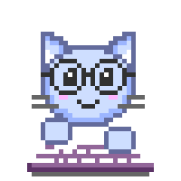

<p align="center">
    
</p>

<div align="center">
  <!-- I got this gif from ACEgif, which provides free-to-use gifs :) go and have a look! -->
  
  
  <h2>
    Hey there! I'm Rick!
  </h2>
</div>

<br />

```C#
public sealed class Rick : Programmer
{
    /// <summary>
    /// For recruiters =>
    /// </summary>
    public const bool IsHappilyEmployed = true;

    /// <summary>
    /// An object–relational mapping framework written in .NET Standard 2.1.
    /// <para> See <see cref="https://github.com/rickvdlaan/orm"/></para>
    /// </summary>
    public string CurrentProject => "ORM";

    /// <summary>
    /// My backend programming languages:
    /// </summary>
    public Backend Backend => Backend.CSharp       |
                              Backend.ObjectPascal |
                              Backend.Sql;

    /// <summary>
    /// My frontend 'programming' languages:
    /// </summary>
    public Frontend Frontend => Frontend.XAML  |
                                Frontend.HTML5 |
                                Frontend.CSS3  |
                                Frontend.TypeScript;

    /// <summary>
    /// The tools I use to do my job well:
    /// </summary>
    public Tools Tools => Tools.VisualStudio2019    |
                          Tools.VistualStudioCode   |
                          Tools.SqlServerProfiler18 |
                          Tools.SSMS                |
                          Tools.Spotify;

    /// <summary>
    /// NuGet packages that make my code better:
    /// </summary>
    public NuGetPackage Packages => NuGetPackage.BenchmarkDotNet |
                                    NuGetPackage.NUnit           |
                                    NuGetPackage.NSubstitute     |
                                    NuGetPackage.Moq             |
                                    NuGetPackage.MsDependencyInjection;
}
```

**Github & programming stats:**  


**Current project:**

[](https://github.com/rickvdlaan/orm)

### Want to connect? 🌎

[](https://www.linkedin.com/in/rickvdlaan/)  [](https://twitter.com/rickvdlaan)
