  

**About me:**

**Languages and Tools:**  

<code></code>
<code></code>
<code></code>
<code></code>

**Github stats:**  

  
**Programming stats:**

  
**Current project:**

### Want to connect? 🌎

  
